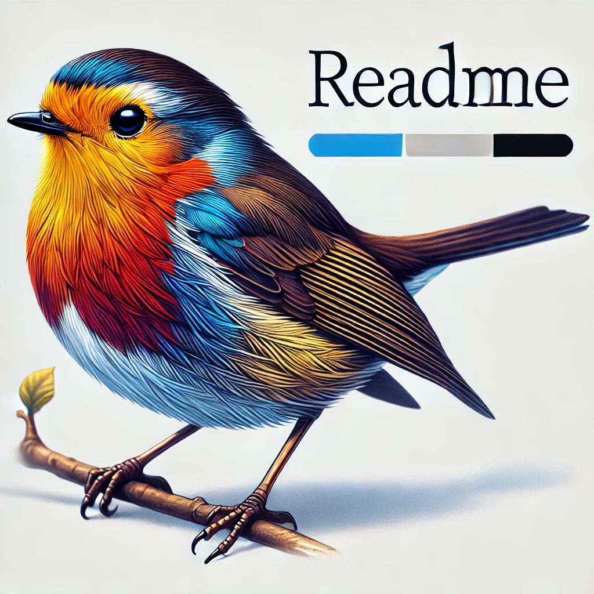

<div align="center">
  <h1>BirdNET Project</h1>
  <p></p>
</div>

## Description
The BirdNET project uses an AI model to analyse bird songs and identify bird species. Thies README provides instructions on how to use this repositiry.

## Table of Contents
- [Usage](#usage)
- [Configuration](#configuration)
- [Script Details](#script-details)


## Usage
1. **Clone the Repository**
First clone the repository to your local machine:
   ```sh
   git clone https://github.com/Jamess200/MyBirdNetTest
   cd birdnet_project
   ```

https://colab.research.google.com/drive/1ofIgH6WYTRZxlmmCn-0VmR4ZYu8mSlAA?usp=sharing